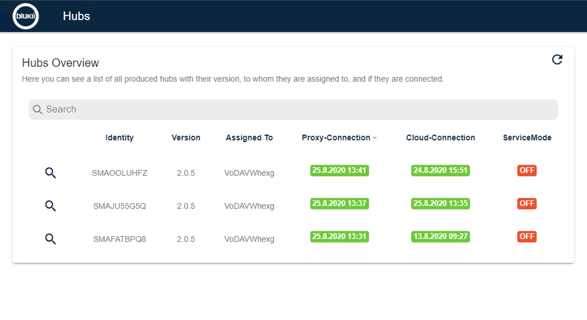
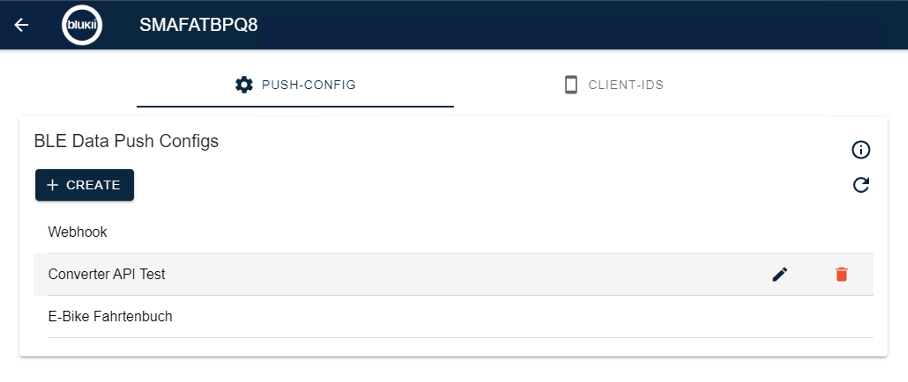
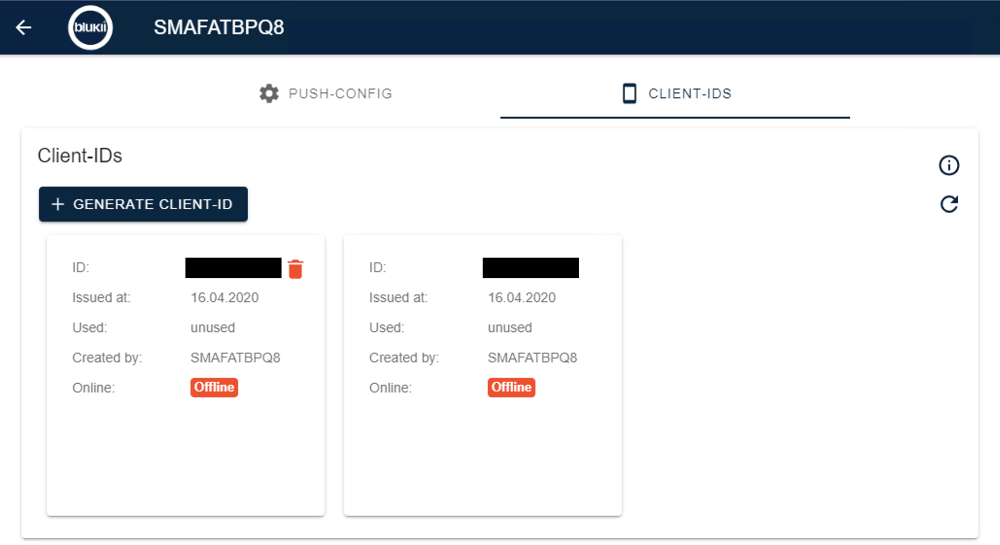
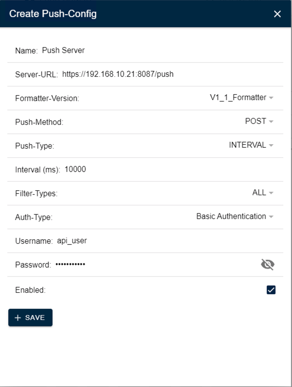

# blukii Admin Panel

With the blukii Admin Panel you can manage your Hubs.

## System Requierements
Windows 7 64 Bit or newer and a Internet Connection.

## Hubs List View

In the Hub View you will see all Hubs that are assigned to your user. 

Values: 
- _Identity_: The unique identifier of the blukii Hub, is also printet on the back of the blukii Hub
- _Version_: The current installed Version of the blukii Hub
- _Proxy-Connection_: The time when the last message was received in the cloud. 
- _Cloud-Connection_: The Timestamp is the timestamp since the Hub is connected to the cloud.
- _ServiceMode_: True or False. The Service Mode allows blukii to remolty access the blukii Hub. The service mode can be enable by pressing the grey Button on the blukii Hub front.

A click on the magnifing glass opens the detail View of the selected Hub.

In the searchbar you can filter the Hub list. You can filter for the fields Identity, Assigned To and Version.

The View will only refresh with a click on the reload button. 

## Hub Detail View

In the Hub Detail View are two Tabs: Push-Config and Client-Ids

### Push-Config
In this view you can manage the Push Configurations of the Hub.

On load the Push Configurations will be loaded from the Hub automatically. With the reload Button you can manually load the Push configurations. If something goes wrong check the internet connection of the hub. 

With a click on create you can add a new Push Configuration. On hover one Push Configuration you can edit or delete the selected Push configuration. You can use more than one Push configuration in parallel. [Details for Push configuration](#push-configuration)

### Client-Ids
In this view all Client-ID are listed. Client-IDs are one time passwords. You can use the ID to login into certain apps which communicate with the Hub.

Values: 
- _ID_: The One Time Password
- _Issued at_: Date of creation 
- _Used_: Date of first time used
- _Created by_: User who created the Certificate
- _Online_: The online/offline State of the Client ID

With Generate Client-ID you can add additional Client-IDs to the hub. On hover a Client-ID you can remove the Client-ID with a click on the trash bin symbol. By Default there are two unused Client IDs.

## Push Configuration

In the Create Push-Config View of the Hub you set all the requiered settings. 

### Name
A readable Name for your Config.

### Server-URL
Remote server to which the data of the blukii Hub should be sent. By default, this value is empty.

### Push-Method
The Http method which is used to push the data to the remote server. 

Valid values are:
- _POST_
- _PUT_

Default Value is:
- _POST_

### Push-Type
Sets the push trigger.

Valid values are:
- _amount_: Push the data to remote server when the amount of frames is received. When there are many sending beacons around the blukii Hub the preferred option should be _interval_.  
- _interval_: Push the data to remote server when the interval is expired.

Default value is:
- _interval_

### Interval(ms) or Amount
The amount of frames, that will be collected before sending it to the server. In this example, the push server is called after one Frame.
This Value is only valid, if the _Push-Type_ is set to _amount_.  

The interval in milliseconds. This value is only valid, if the _Push-Type_ is set to _interval_.

### Filter Types
Specify which type of data (Frames) will be pushed to the remote server.

Selectable Values are: 
- _All_: All Beacon frames will be pushed to the remote server. Values _SensorBeacon_, _eddystone_, _IBeacon_ will be ignored. 
- _SensorBeacon_: All Sensor frames will be pushed to the remote server.
- _Eddystone_: All Eddystone frames will be pushed to the remote server.
- _IBeacon_: All iBeacon frames will be pushed to the remote server.

### Auth-Type
The method of authentication for the remote Server

Valid values are:
- _No Authentification_: No authentication
- _Basic Authentification_: HTTP Basic Authentication. Requires: _username_, _password_ 
- _OAuth Client Credentials Grant_: OAuth Client Credentials Gant. Requires: _clientId_, _secret_
- _OAuth Password Grant_: OAuth User Password Grant. Requires: _username_, _password_, _clientId_, _secret_

Default value is:
- _No Authentification_

### Enabled
Enables or disables the current Configuration. 