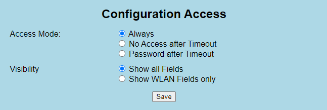
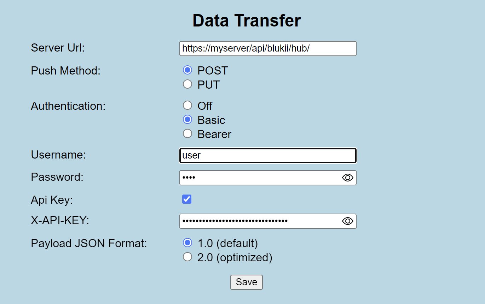

blukii Hub Configuration Website
=====================

Access the Website
------------------

You can access the configuration website via http://*<serial_number>*.local (e.g. [http://hubabcd0123.local/](http://hubabcd0123.local/)) if your network supports the mDNS protocol.

Alternatively you have access it via hostname: [http://hubabcd0123/](http://hubabcd0123/) if this is supported by your network.

Finally it can be accessed via local IP address. Therefore please ask your network administrator.

If the website can not be accessed, restricted access could be a reason. Therefore see section [Configuration Access](#configuration-access).

Configuration Sections
----------------------

The Configuration view is separated in topic related sections. Each section must be saved separately after editing a value.

### WLAN Credentials

Settings for connecting to a WLAN network.

* Secure Mode

  * **WPA/WPA2**: Basic Authentication with **SSID** and **Password**

  * **WPA2 Enterprise**: Enterprise Authentication with **SSID**, **Identity** and **Password**

* Note:

  * If the WLAN credentials are changed, the blukii Hub is restarted.

  * If SSID or Password are empty, the WLAN Access Point will be activated.

### Configuration Access

Settings for limiting the **Access** to this configuration website.

* **Always**: the configuration website is always accessible for everyone in the local network(default).

* **No Access after Timeout**: the configuration website is accessible for everyone as long as the **Timeout (in seconds)** is not expired. The Timeout is restarted after startup or short press of push button.

* **Password after Timeout**: the configuration website is accessible for everyone as long as the **Timeout (in seconds)** is not expired. After that the user has to insert the **Password** for configuration access. The Timeout will be restarted after startup or short press of push button.

### Data Processing

Settings for scan and collection of blukii advertising data.

* **Data Types**: Defines, which blukii data packet types are collected.

  * **iBeacon**: UUID, Major, Minor, Measured Power

  * **Eddystone UID**: Namespace, Instance

  * **Eddystone TLM**: Battery (in mV), Temperature, Packets, Active Time

  * **Sensor Beacon**: Accelerometer Axis Values

  * **Device Tracing**: RSSI-Distance to other blukii Device Tracing Beacons

  * **Special Frame**: Customer defined or future values

* **Collection Mode**:

  * **One Per Data Type**: For each packet type and blukii Beacon will be collected only one (the last) packet during push interval.

  * **All Packets**: All packets are collected. Duplicates of packet type and blukii Beacon are allowed.

* **Push Interval**: Time (in seconds) of one collection duration.

Note:

* It is recommended to reduce the processed and transferred data amount. Consider the Data Processing settings for optimizing your system:

  * Check only relevant data types.

  * Use Collection Mode “All Packets” only for high performance data logging like Accelerometer Sensor.

  * Use fast push interval (smaller than 5 seconds) only for high performance data logging or for high update rates.

  * The data packet amount per push interval is limited (depends on selected data types and amount of different blukii IDs) to approx. 75 data packets.

* After every push interval duration a push request will be sent to the defined server url. If no data packet is found during the push interval, the request is skipped.

* If request is done, the green LED will be paused until the request is finished.

* blukii Hub does not support third party beacons (blukii Beacons only).

### Data Transfer

Settings for connection to the target server for blukii packet data.

* **Server Url**: Target server url for push requests

* **Push Method**:

  * **POST**

  * **PUT**

* **Authentication**

  * **Off**: No Authentication

  * **Basic**: Basic Authentication (Username, Password)

  * **Bearer:** Bearer Token Authentication (Token)

* **Api Key**: Optional additional ApiKey Authentication (X-API-KEY)

* **Payload JSON Format**: JSON Format in push request body

  * **1.0 (default)**: Standard format with pre-parsed values

  * **2.0 (optimized)**: Size optimized format with byte coding

### System Settings

Administrative settings for system logging and maintainance.

* **Log Level**: Level of system logging messages

  * **Severe**

  * **Warning** (default)

  * **Info**

  * **Debug**

* **Log To File**: Log Messages are stored in internal log file (default: off).

* **Log To blukii Server**: Log Messages are sent to blukii monitoring server (default: on).

* **Get Firmware Updates:** The Hub is periodically checking, if a firmware update is available (default: on).

Note:

* Change **Log Level** and **Log To File** only in consultation with blukii support! This may affect the system performance.

* For **Log To blukii Server** a internet connection is needed. Only system processing data is logged, no passwords or api keys. It is recommended to switch this feature off, if the Hub is in a local network without external access.

* **Firmware Updates** are done remotely by blukii Support in coordination with the Hub owner. During the update, red and green LED are blinking simultaneously.
