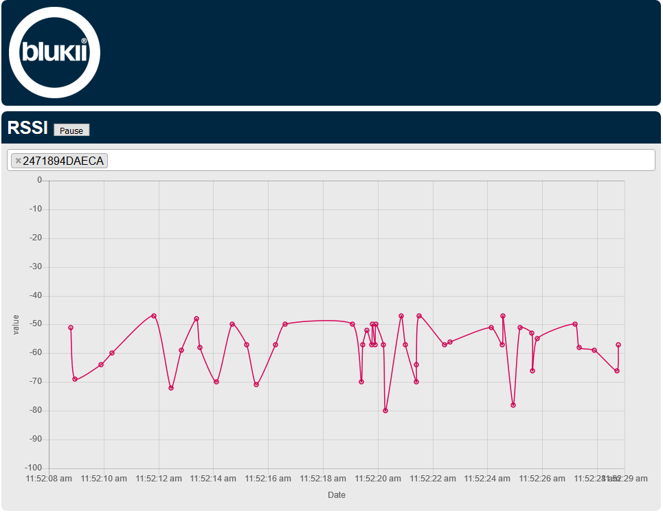

# Customer documenetation blukii Hub
In this documentation the api functions of the blukii hub are described in order to retrieve the received data from the server.
The blukii Hub is assigned an IP address / hostname needed to retrieve data.

The IP Address can be determined as follows:
- For small networks over the router.
- For large networks, you need to contact your network administrator.

## Graphical representation of bluki RSSI value
RSSI stands for Received Signal Strength Indicator. The RSSI value is a measure of the received signal strength of the sensor beacon. As a rule of thumb, with an RSSI value of -57, the sending beacon is approximately 1m away from the receiver under optimal conditions.
The graphical representation of the RSSI value can be displayed in the browser with the following call:

### Hub:  
```
http://<hostname>/Hub
```
**Example:**  
```
http://192.168.178.20/hub
```
In response you get the following page, with which one or more blukiis can be selected and the respective RSSI values are displayed.  



### Server:  
The graphic can also be displayed on the server side. Difference to the hub graphic is the additional choice of a particular hub.
 ```
 http://<hostname>/server
 ```
**Example:**  
 ```
 http://192.168.178.20/server
 ```


## API Interface
The blukii server provides a REST API interface with which data, via GET commands, can be read by the server.
A quick reference to the functions offered by the API can be viewed using the command below.
```
http://<hostname>/api
```

In the following, the individual commands that are available to the user are explained in detail.

### show Hubs
```
http://<hostname>/api/hub
```
**Example:**
```
http://192.168.178.20/api/hub
```
**Output:**
```
[
    {
        "mac": "B827EB43B8CB"
    },
    {
        "mac": "B827EBA8BA22"
    },
    {
        "mac": "B827EBCE32DE"
    }
]
```
The output is a list in JSON format, with blukii hubs (Bluetooth MAC address) that have ever sent data to the server.
- _mac_: Bluetooth MAC-Address

<a name="blukiisAnzeigen"></a>
### show blukiis
```
http://<hostname>/api/blukii
```
**Example:**
```
http://192.168.178.20/api/blukii
```
**Output:**
```
[
  {
      "address": "12ACA0B72EFF",
      "battery": 0
  },
  {
      "address": "247189281792",
      "battery": 94
  },
  {
      "address": "2471894DAECA",
      "battery": 100
  }
]
```
The output is a list in JSON format, with all blukiis that have ever sent data to a hub.
- _address_: blukii_address, uniquely identifies each blukii.
- _battery_: battery level in percent of blukii.


### Show all blukiis that have sent to a specific hub
```
http://<hostname>/api/hub/<mac>/blukii
```
**Example:**
```
http://192.168.178.20/api/hub/B827EB98DE03/blukii
```
The output is the same as at [ show blukiis ](#blukiisAnzeigen)

<a name="speziellerBlukiiAnzeigen"></a>
### Show all data of a particular blukii
```
http://<hostname>/api/blukii/<blukii_address>
```
**Example:**
```
http://192.168.178.20/api/blukii/2471894DAECA
```
**Output:**
```
last_entries	         1000
blukii	                 "2471894DAECA"
firstValue	         1519378905.967
lastValue	         1519734269.152
rssi_default	         […]
unknown_default	         […]
magnet_default	         […]
acceleration_default	 […]
environment_default	 […]
```
The output is all the data related to the selected blukii.

#### Entries that are always available, regardless of the configuration of blukiis:

- _last_entries_: Number of records loaded per category.  
- _blukii_: blukii_address maps the data to a specific blukii.
- _firstValue_: Unix timestamp with time for the oldest record in the database.
- _last_value_: Unix timestamp with the time of the most recent record.
- _rssi_default_: Returns a list of records with information about the Bluetooth connection.

#### Entries that are available depending on the configuration of the blukiis:

- _unknown_default_: Returns a list of records that are not known.
- _magnet_default_: Returns a list of data sets with measured values of the magnetic sensor.
- _acceleration_default_: Returns a list of data records with measured values of the acceleration sensor.
- _environment_default_: Returns a list of datasets with environmental metrics such as barometric pressure, light, humidity, and temperature.

#### rssi_default
Rssi_default contains a list of records, in JSON format, with the following content:
```
 "rssi_default":[
                  {
                      "id": 17962614,
                      "hub": "B827EB43B8CB",
                      "timestamp": 1519734269.152,
                      "rssi": -68
                  },
                  {
                      "id": 17962613,
                      "hub": "B827EB43B8CB",
                      "timestamp": 1519734268.623,
                      "rssi": -65
                  }
                ]
```
- _id_: Sequential number that is incremented per record.
- _hub_: ID of the hub to which the blukii has sent.
- _timestamp_: Time of data acquisition in the form of a Unix timestamp.
- _rssi_: RSSI measured value.

The records are sorted in descending order according to id.

#### unknown_default
Unknown_default contains a list of records, in JSON format, with the following content:
```
"unknown_default": [
                    {
                        "id": 623642,
                        "hub": "B827EBA8BA22",
                        "timestamp": 1519658363.901,
                        "fw_major": 3,
                        "fw_minor": 5,
                        "frametype": "FF",
                        "frame": "FFFFFFFFFFFFFFFF"
                    },
                    {
                        "id": 623641,
                        "hub": "B827EBA8BA22",
                        "timestamp": 1519658363.59,
                        "fw_major": 3,
                        "fw_minor": 5,
                        "frametype": "FF",
                        "frame": "FFFFFFFFFFFFFFFF"
                    }
                  ]
```
- _id_: Sequential number that is incremented per record.
- _hub_: ID of the hub to which the blukii has sent.
- _timestamp_: Time of data acquisition in the form of a Unix timestamp.
- _fw_major_: Firmware version
- _fw_minor_: Firmware Version
- _frametype_:
- _frame_:

The records are sorted in descending order according to id.

#### magnet_default
Magnet_default contains a list of records, in JSON format, with the following content:
```
"magnet_default": [
                    {
                        "id": 4357330,
                        "hub": "B827EB43B8CB",
                        "timestamp": 1519734268.623,
                        "x": 4035,
                        "y": -2220,
                        "z": 5621
                    },
                    {
                        "id": 4357329,
                        "hub": "B827EB43B8CB",
                        "timestamp": 1519734266.497,
                        "x": 4013,
                        "y": -2168,
                        "z": 5690
                    }
                  ]
```

- _id_: Sequential number that is incremented per record.
- _hub_: ID of the hub to which the blukii has sent.
- _timestamp_: Time of data acquisition in the form of a Unix timestamp.
- _x_: Magnetic flux density through the X-axis of the sensor in [mGauss].
- _y_: Magnetic flux density through the Y-axis of the sensor in [mGauss].
- _z_: Magnetic flux density through the Z-axis of the sensor in [mGauss].

The records are sorted in descending order according to id.

#### acceleration_default
```
"acceleration_default": [
                          {
                              "id": 5489227,
                              "hub": "B827EB43B8CB",
                              "timestamp": 1519734269.152,
                              "x": -24,
                              "y": -30,
                              "z": 1167
                          },
                          {
                              "id": 5489226,
                              "hub": "B827EB43B8CB",
                              "timestamp": 1519734268.602,
                              "x": -27,
                              "y": -29,
                              "z": 1172
                          }
                        ]
```

- _id_: Sequential number that is incremented per record.
- _hub_: ID of the hub to which the blukii has sent.
- _timestamp_: Time of data acquisition in the form of a Unix timestamp.
- _x_: acceleration in the X direction in [mg].
- _y_: acceleration in the Y direction in [mg].
- _z_: acceleration in the Z direction in [mg].

The records are sorted in descending order according to id.

#### environment_default
```
"environment_default": [
                        {
                            "id": 3653916,
                            "hub": "B827EB43B8CB",
                            "timestamp": 1519734268.362,
                            "pressure": 938,
                            "light": 40,
                            "humidity": 14,
                            "temperature": 23.1875
                        },
                        {
                            "id": 3653915,
                            "hub": "B827EB43B8CB",
                            "timestamp": 1519734267.939,
                            "pressure": 938,
                            "light": 40,
                            "humidity": 14,
                            "temperature": 23.1875
                        }
                      ]
```

- _id_: Sequential number that is incremented per record.
- _hub_: ID of the hub to which the blukii has sent.
- _timestamp_: Time of data acquisition in the form of a Unix timestamp.
- _pressure_: air pressure in [hPa].
- _light_: Illuminance in [lux].
- _humidity_: Humidity in [%].
- _temperature_: temperature in [° C].

The records are sorted in descending order according to id.

### Display specific data of a blukiis (filter)

The filters can be used to query exactly the data that is needed. How the filtering works is described in this section.

 The blukii is selected as described in chapter ["Show all data of a specific blukii"](#speziellerBlukiiAnzeigen). In addition, the desired filters must be added.

#### Filtering by parameter
```
http://<hostname>/api/blukii/<blukii_address>?filter=<Parameter>,<Parameter>,<Parameter>
```
Possible filter parameters are:
- rssi
- environment
- acceleration
- magcounter
- magnet
- unknown
- first
- last

**Example:**
```
http://192.168.178.20/api/blukii/2471894DAECA?filter=environment,acceleration,first,last
```
**Output:**
```
{
    "blukii": "2471894DAECA",
    "firstValue": 1519378905.967,
    "lastValue": 1519802518.392,
    "acceleration_first": [
        {
            "id": 203,
            "hub": "B827EBA8BA22",
            "timestamp": 1519378912.401,
            "x": -22,
            "y": -27,
            "z": 1187
        }
    ],
    "acceleration_last": [
        {
            "id": 6434026,
            "hub": "B827EB43B8CB",
            "timestamp": 1519802518.392,
            "x": -2046,
            "y": -2046,
            "z": 1132
        }
    ],
    "environment_first": [
        {
            "id": 152,
            "hub": "B827EBA8BA22",
            "timestamp": 1519378905.967,
            "pressure": 938,
            "light": 40,
            "humidity": 32,
            "temperature": 24.125
        }
    ],
    "environment_last": [
        {
            "id": 4277319,
            "hub": "B827EB43B8CB",
            "timestamp": 1519802512.735,
            "pressure": 937,
            "light": 491,
            "humidity": 38,
            "temperature": -12.3672
        }
    ]
}
```
- _blukii_: blukii_address maps the data to a specific blukii.
- _firstValue_: Unix timestamp with time, the oldest record in the database.
- _last_value_: Unix timestamp with the time of the most recent record.
- _acceleration_first_: Oldest accelerometer.
- _acceleration_last_: Latest accelerometer.
- _environment_first_: Oldest environment record.
- _environment_last_: Latest environment record.

The records are sorted in descending order according to id.

#### Filtering by parameter and time
```
http://<hostname>/api/blukii/<blukii_address>?filter=<Parameter>,<Parameter>&after=<Unix timestamp>&before=<Unix timestamp>
```


Possible time filters are:
- after: records after a certain time.
- before: records before a certain time.
- The combination of before and after defines a period of time.


**Example:**
```
http://192.168.178.20/api/hub/B827EB43B8CB/blukii/2471894DAECA?filter=environment&after=1519732800&before=1519732860
```
**Output:**
```
hub	                "B827EB43B8CB"
blukii	                "2471894DAECA"
max_entries             43200
after	                "1519732800"
before	                "1519732860"
firstValue              1519378928.948
lastValue               1519807912.058
environment_default	[…]
```
- _hub_: Number of the hub used to receive the following readings.
- _blukii_: blukii_address maps the data to a specific blukii.
- _max_entries_: Number of maximum records.
- _after_: Unix timestamp with the time from which data is output.
- _before_: Unix timestamp at the time at which data is being output.
- _firstValue_: Unix timestamp with time, the oldest record in the database.
- _last_value_: Unix timestamp with the time of the most recent record in the database.
- _environment_default_: list of environment records for the given period.

The records are sorted by the id ascending.

## Push interface

The blukii hub saves the received data of all blukiis and sends it to the server.
If you as a customer want to use your own server, you must ensure that the server correctly interprets and processes the data from the blukii Hub.
The data is sent from the blukii hub via a push interface in JSON format.
The following is a structure of a JSON record. The structure of a data record depends on the hardware variant and the configuration of the blukii sensorBeacon. In the example below, the following configuration was used:
- blukii Hub
  - Bluetooth MAC-Adresse: B827EBA8BA22
- blukii sensorBeacon
  - blukii_address: 2471894DAECA
  - all sensor readings are sent
- blukii sensorBeacon
  - blukii_address: 2471894DA7C2
  - Only the environment readings are sent

**Output**
```
{
  "id": "B827EBA8BA22",
  "data": [
    {
      "address": "2471894DAECA",
      "battery": 92,
      "rssi": [
        {
          "rssi": -80,
          "timestamp": "1519828820"
        }
      ],
      "acceleration": [
        {
          "timestamp": "1519828820",
          "x": -13,
          "y": -26,
          "z": 1164
        }
      ],
      "magnet": [
        {
          "timestamp": "1519828816",
          "x": 1292,
          "y": 568,
          "z": 8070
        }
      ],
      "environment": [
        {
          "humidity": 13,
          "light": 245,
          "pressure": 936,
          "temperature": 24.3125,
          "timestamp": "1519828819"
        }
      ]
    },
    {
      "address": "2471894DA7C2",
      "battery": 100,
      "rssi": [
        {
          "rssi": -98,
          "timestamp": "1519829182"
        }
      ],
      "environment": [
        {
          "humidity": 30,
          "light": 20000,
          "pressure": 950,
          "temperature": 18.0035,
          "timestamp": "1519829190"
        }
      ]
    }
  ]
}
```
Basically, a new block is added per sensorBeacon from which the Hub receives data.
Such a block always consists of:
- _address_
- _battery_
- _rssi_

Depending on the configuration and hardware variant of the sensorBeacon, the following parts may be added:
- _acceleration_
-  _magnet_
- _environment_
