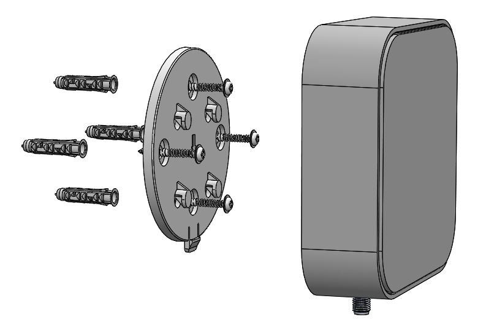

# blukii Hub Wall assembly

Use the in the delivery included wall mounting kit for assembling the Hub to the wall. Fix the plate with 4 screws to the wall and you can mount and remount the hub housing.

